# media-database

This small **PostgreSQL** database was created for educational purposes.
Use it for your web apps, native apps, or any stack your practicing with.

This can be helpful for Front End Developers who want to quickly set up an
experimental database and stay focused on their core work, without delving into
database design. It also serves as a basic template for building custom
databases.

Below is the ERD. The SVG was generated by Mermaid (optional: see the ddl.mmd)

  

> Many **users** can have many **medias** of specific **media_types**: VHS,
DVD, Blu-ray, etc.

### File prefixes
SQL files are prefixed by **ddl**, **dml**, and **dql** for convenience.

### Data examples
Some medias are ficticious, as well as default users.

## Usage

### ddl
> Run the **ddl.sql** in your PostgreSQL.

This creates the tables and its relationships to each other.

> Besides running locally, there are cloud PostgreSQL databases with free tiers,
such as [Supabase](https://supabase.com/) or [Neon](https://neon.com/).

### dml
Run the dlm-*.sql files in the following order:

> 1. Run **dml-media-types.sql**
> 1. Run **dml-medias.sql**
> 1. Run **dml-users.sql**
> 1. Run **dml-users-medias.sql**

### dql
Use the **dql-get-user-collection.sql** query as a template, swapping out actual
values with variables in your desired stack.

## AI Generated Wiki
https://deepwiki.com/reyarqueza/media-database
